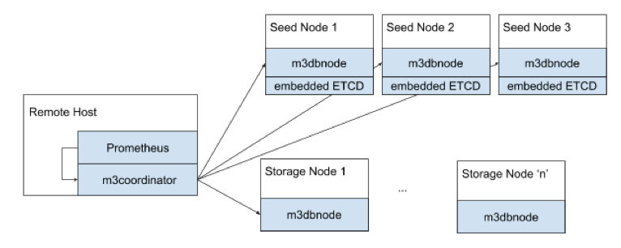

# M3DB Cluster Deployment, Manually (The Hard Way)

## Introduction

This document lists the manual steps involved in deploying a M3DB cluster. In practice, you'd be automating this using Terraform or using Kubernetes rather than doing this by hand; guides for doing so are available under the How-To section.

## Primer Architecture
A quick primer on M3DB architecture. Here’s what a typical deployment looks like:



A few different things to highlight about the diagram:

### Role Type

There are three ‘role types’ for a m3db deployment -

- Coordinator: `m3coordinator` serves to coordinate reads and writes across all hosts in the cluster. It’s a lightweight process, and does not store any data. This role would typically be run alongside a Prometheus instance, or be baked into a collector agent.

- Storage Node: `m3dbnode` processes running on these hosts are the workhorses of the database, they store data; and serve reads and writes.

- Seed Node: First and foremost, these hosts are storage nodes themselves. In addition to that responsibility, they run an embedded ETCD server. This is to allow the various M3DB processes running across the cluster to reason about the topology/configuration of the cluster in a consistent manner.

Note: In very large deployments, you’d use a dedicated ETCD cluster, and only use M3DB Storage and Coordinator Nodes

## Provisioning
Enough background, lets get you going with a real cluster! Provision your host (be it VMs from AWS/GCP/etc) or bare-metal servers in your DC with the latest and greatest flavour of Linux you favor. M3DB works on all popular distributions - Ubuntu/RHEL/CentOS, let us know if you run into issues on another platform and we’ll be happy to assist.

### Network
If you’re using AWS or GCP it is highly advised to use static IPs so that if you need to replace a host, you don’t have to update your configuration files on all the hosts, you simply decomission the old seed node and provision a new seed node with the same host ID and static IP that the old seed node had.  For AWS you can use a [Elastic Network Interface](https://docs.aws.amazon.com/AWSEC2/latest/UserGuide/using-eni.html) on a VPC and for GCP you can simply use an [internal static IP address](https://cloud.google.com/compute/docs/ip-addresses/reserve-static-internal-ip-address).

In this example you will be creating three static IP addresses for the three seed nodes.

Further, we assume you have hostnames configured correctly too. i.e. running `hostname` on a host in the cluster returns the host ID you'll be using when specifying instance host IDs when creating the M3DB cluster placement. E.g. running `hostname` on a node `m3db001` should return it's host ID `m3db001`.

In GCP the name of your instance when you create it will automatically be it's hostname. When you create an instance click "Management, disks, networking, SSH keys" and under "Networking" click the default interface and click the "Primary internal IP" drop down and select "Reserve a static internal IP address" and give it a name, i.e. `m3db001`, a description that describes it's a seed node IP address and use "Assign automatically".

In AWS it might be simpler to just use whatever the hostname you get for the provisioned VM as your host ID when specifying M3DB placement.  Either that or use the `environment` host ID resolver and pass your host ID when launching the database process with an environment variable.  You can set to the host ID and specify the environment variable name in config as `envVarName: M3DB_HOST_ID` if you are using an environment variable named `M3DB_HOST_ID`.

Relevant config snippet:
```
hostID:
  resolver: environment
  envVarName: M3DB_HOST_ID
```

Then start your process with:
```
M3DB_HOST_ID=m3db001 m3dbnode -f config.yml
```

### Kernel
Ensure you review our [recommended kernel configuration](../operational_guide/kernel_configuration.md) before running M3DB in production as M3DB may exceed the default limits for some default kernel values.

## Config files
We wouldn’t feel right to call this guide, “The Hard Way” and not require you to change some configs by hand.

Note: the steps that follow assume you have the following 3 seed nodes - make necessary adjustment if you have more or are using a dedicated ETCD cluster. Example seed nodes:

- m3db001 (Region=us-east1, Zone=us-east1-a, Static IP=10.142.0.1)
- m3db002 (Region=us-east1, Zone=us-east1-b, Static IP=10.142.0.2)
- m3db003 (Region=us-east1, Zone=us-east1-c, Static IP=10.142.0.3)

We’re going to start with the M3DB config template and modify it to work for your cluster. Start by downloading the [config](https://github.com/m3db/m3/blob/master/src/dbnode/config/m3dbnode-cluster-template.yml). Update the config ‘service’ and 'seedNodes' sections to read as follows:

```
config:
  service:
    env: default_env
    zone: embedded
    service: m3db
    cacheDir: /var/lib/m3kv
    etcdClusters:
      - zone: embedded
        endpoints:
          - 10.142.0.1:2379
          - 10.142.0.2:2379
          - 10.142.0.3:2379
  seedNodes:
    initialCluster:
      - hostID: m3db001
        endpoint: http://10.142.0.1:2380
      - hostID: m3db002
        endpoint: http://10.142.0.2:2380
      - hostID: m3db003
        endpoint: http://10.142.0.3:2380
```


## Start the seed nodes
Transfer the config you just crafted to each host in the cluster. And then starting with the seed nodes, start up the m3dbnode process:

```
m3dbnode -f <config-name.yml>
```

Note, remember to daemon-ize this using your favourite utility: systemd/init.d/supervisor/etc

## Create Namespace and Initialize Topology

The recommended way to create a namespace and initialize a topology is to use the `/database/create` api. Below is an example.

**Note:** In order to create a more custom setup, please refer to the [namespace configuration](../operational_guide/namespace_configuration.md) and 
[placement configuration](../operational_guide/placement_configuration.md) guides, though this is discouraged.

```json
curl -X POST http://localhost:7201/api/v1/database/create -d '{
  "type": "cluster",
  "namespaceName": "1week_namespace",
  "retentionTime": "168h",
  "numShards": "1024",
  "replicationFactor": "3",
  "hosts": [
        {
            "id": "m3db001",
            "isolation_group": "us-east1-a",
            "zone": "embedded",
            "weight": 100,
            "endpoint": "10.142.0.1:9000",
            "hostname": "m3db001",
            "port": 9000
        },
        {
            "id": "m3db002",
            "isolation_group": "us-east1-b",
            "zone": "embedded",
            "weight": 100,
            "endpoint": "10.142.0.2:9000",
            "hostname": "m3db002-us-east",
            "port": 9000
        },
        {
            "id": "m3db003",
            "isolation_group": "us-east1-c",
            "zone": "embedded",
            "weight": 100,
            "endpoint": "10.142.0.3:9000",
            "hostname": "m3db003",
            "port": 9000
        }
    ]
}'
```

**Note:** Isolation group specifies how the cluster places shards to avoid more than one replica of a shard appearing in the same replica group. As such you must be using at least as many isolation groups as your replication factor. In this example we use the availibity zones `us-east1-a`, `us-east1-b`, `us-east1-c` as our isolation groups which matches our replication factor of 3.

Shortly after, you should see your node complete bootstrapping:

```
20:10:12.911218[I] updating database namespaces [{adds [default]} {updates []} {removals []}]
20:10:13.462798[I] node tchannelthrift: listening on 0.0.0.0:9000
20:10:13.463107[I] cluster tchannelthrift: listening on 0.0.0.0:9001
20:10:13.747173[I] node httpjson: listening on 0.0.0.0:9002
20:10:13.747506[I] cluster httpjson: listening on 0.0.0.0:9003
20:10:13.747763[I] bootstrapping shards for range starting ...
...
20:10:13.757834[I] bootstrap finished [{namespace metrics} {duration 10.1261ms}]
20:10:13.758001[I] bootstrapped
20:10:14.764771[I] successfully updated topology to 3 hosts
```

### Replication factor (RF)

Recommended is RF3, where each replica is spread across failure domains such as a rack, data center or availability zone. See [Replication Factor Recommendations](../operational_guide/replication_and_deployment_in_zones) for more specifics.

### Shards

See [placement configuration](../operational_guide/placement_configuration.md) to determine the appropriate number of shards to specify.

## Test it out

Now you can experiment with writing tagged metrics:

```json
curl -sS -X POST localhost:9003/writetagged -d '{
  "namespace": "metrics",
  "id": "foo",
  "tags": [
    {
      "name": "city",
      "value": "new_york"
    },
    {
      "name": "endpoint",
      "value": "/request"
    }
  ],
  "datapoint": {
    "timestamp": '"$(date "+%s")"',
    "value": 42.123456789
  }
}'
```

And reading the metrics you've written:

```json
curl -sS -X POST http://localhost:9003/query -d '{
  "namespace": "metrics",
  "query": {
    "regexp": {
      "field": "city",
      "regexp": ".*"
    }
  },
  "rangeStart": 0,
  "rangeEnd": '"$(date "+%s")"'
}' | jq .
```

## Integrations

[Prometheus as a long term storage remote read/write endpoint](../integrations/prometheus.md).
