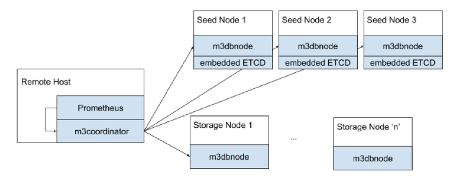

# M3DB Multi-Node Deployment, The Hard Way

## Introduction
This document lists the manual steps involved in deploying a M3DB cluster. In practice, you wouldn’t be doing this by hand, you’d be automating it using Terraform or Kubernetes. If you’re interested in how you could do so, we have some other guides you might be interested under the How-To section on https://m3db.github.io/m3db/

## Primer Architecture
A quick primer on M3DB architecture. Here’s what a typical deployment looks like:




A few different things to highlight about the diagram:

### Role Type

There are three ‘role types’ for a m3db deployment -

- m3coordinator: the m3coordinator binary serves to coordinate reads and writes across all hosts in the cluster. It’s a lightweight process, and does not store any data when running in this mode. This role would typically be run alongside a Prometheus instance, or be baked into a collector agent.

- Storage Node: m3dbnode processes running on these hosts are the workhorses of the database, they store data; and serve reads and writes.

- Seed Node: First and foremost, these hosts are storage nodes themselves. In addition to that responsibility, they run an embedded ETCD server. This is to allow the various M3DB processes running across the cluster to reason about the topology/configuration of the cluster in a consistent manner.

Note: In large deployments, you’d use a dedicated ETCD cluster, and only use M3DB Storage and Coordinator Nodes


## Provisioning
Enough background, lets get you going with a real cluster! Provision your host (be it VMs from AWS/GCP/etc) or bare-metal servers in your DC with the latest and greatest flavour of Linux you favor. M3DB works on all popular distributions - Ubuntu/RHEL/CentOS, let us know if you run into issues on another platform and we’ll be happy to assist.

### Network
If you’re using AWS or GCP it is highly advised to use Virtual IP Addresses (VIPs) so that if you need to replace a host, you don’t have to update your configuration files on all the hosts.

In this example we assume you have created three VIPs m3db001-us-east, m3db002-us-east and m3db003-us-east for m3db001-us-east, m3db002-us-east, and m3db003-us-east respectively.

Further, we assume you have hostnames configured correctly too. i.e. running `hostname` on a host in the cluster returns the hostname. E.g. running `hostname` on `m3db001-us-east` should return `m3db001-us-east`.

### Kernel
m3dbnode uses a lot of mmap-ed files for performance, as a result, you might need to bump vm.max_map_count. We suggest setting this value to 262,144 when provisioning your VM, so you don’t have to come back and debug issues later.

## Config files
We wouldn’t feel right to call this guide, “The Hard Way” and not require you to change some configs by hand.

Note: the steps that follow assume you have the following 3 seed nodes - make necessary adjustment if you have more or are using a dedicated ETCD cluster. Example seed nodes:

- m3db001 (Region=us-east1, Zone=us-east1-b VIP=10.0.0.1)
- m3db002 (Region=us-east1, Zone=us-east1-c VIP=10.0.0.1)
- m3db003 (Region=us-east1, Zone=us-east1-d VIP=10.0.0.1)

We’re going to start with the M3DB config template and modify it to work for your cluster. Start by downloading the [config](https://github.com/m3db/m3db/blob/master/src/dbnode/config/m3dbnode-local.yml). Update the ‘service’ section to read as follows:

```
config:
      service:
          env: production
          zone: cluster-us-east1
          service: m3db
          cacheDir: /var/lib/m3kv
          etcdClusters:
              # Client discovery
              - zone: cluster-us-east1
                endpoints:
                    - 10.0.0.1:2379
                    - 10.0.0.2:2379
                    - 10.0.0.3:2379
      seedNodes:
          initialCluster:
              # Server discovery
              - hostID: m3db001
                endpoint: http://10.0.0.1:2380
              - hostID: m3db002
                endpoint: http://10.0.0.2:2380
              - hostID: m3db003
                endpoint: http://10.0.0.3:2380
```


## Start em up
Transfer the config you just crafted to each host in the cluster. And then starting with the seed nodes, start up the m3dbnode process:

```
m3dbnode -f <config-name>
```

Note, remember to daemon-ize this using your favourite utility: systemd/init.d/supervisor/etc

## Initialize Topology
M3DB calls its cluster topology ‘placement’. Run the command below on any of the seed nodes to initialize your first placement.

```json
curl -X POST localhost:7201/placement/init -d '{
    "num_shards": 1024,
    "replication_factor": 3,
    "instances": [
        {
            "id": "m3db001-us-east",
            "isolation_group": "us-east-1",
            "zone": "embedded",
            "weight": 100,
            "endpoint": "m3db001-us-east:9000",
            "hostname": "m3db001-us-east",
            "port": 9000
        },
        {
            "id": "m3db002-us-east",
            "isolation_group": "us-east-2",
            "zone": "embedded",
            "weight": 100,
            "endpoint": "m3db002-us-east:9000",
            "hostname": "m3db002-us-east",
            "port": 9000
        },
        {
            "id": "m3db003-us-east",
            "isolation_group": "us-east-3",
            "zone": "embedded",
            "weight": 100,
            "endpoint": "m3db003-us-east:9000",
            "hostname": "m3db003-us-east",
            "port": 9000
        }
    ]
}'
```

## Create namespace(s)
A namespace in M3DB is similar to a table in Cassandra (C*). You can specify retention/resolution and a few distinct properties on a namespace.

Run the following on any seed node to create a ‘metrics’ namespace:

```json
curl -X POST localhost:7201/namespace/add -d '{
  "name": "metrics",
  "options": {
    "bootstrapEnabled": true,
    "flushEnabled": true,
    "writesToCommitLog": true,
    "cleanupEnabled": true,
    "snapshotEnabled": false,
    "repairEnabled": false,
    "retentionOptions": {
      "retentionPeriodNanos": 172800000000000,
      "blockSizeNanos": 7200000000000,
      "bufferFutureNanos": 600000000000,
      "bufferPastNanos": 600000000000,
      "blockDataExpiry": true,
      "blockDataExpiryAfterNotAccessPeriodNanos": 300000000000
    },
    "indexOptions": {
      "enabled": true,
      "blockSizeNanos": 7200000000000
    }
  }
}'
```

Shortly after, you should see your node complete bootstrapping!

```
20:10:12.911218[I] updating database namespaces [{adds [default]} {updates []} {removals []}]
20:10:13.462798[I] node tchannelthrift: listening on 0.0.0.0:9000
20:10:13.463107[I] cluster tchannelthrift: listening on 0.0.0.0:9001
20:10:13.747173[I] node httpjson: listening on 0.0.0.0:9002
20:10:13.747506[I] cluster httpjson: listening on 0.0.0.0:9003
20:10:13.747763[I] bootstrapping shards for range starting ...
...
20:10:13.757834[I] bootstrap finished [{namespace metrics} {duration 10.1261ms}]
20:10:13.758001[I] bootstrapped
20:10:14.764771[I] successfully updated topology to 3 hosts
```

Read more about namespaces and the various knobs in the docs.

## Test it out

Now you can experiment with writing tagged metrics:

```json
curl -sSf -X POST localhost:9003/writetagged -d '{
  "namespace": "metrics",
  "id": "foo",
  "tags": [
    {
      "name": "city",
      "value": "new_york"
    },
    {
      "name": "endpoint",
      "value": "/request"
    }
  ],
  "datapoint": {
    "timestamp": '"$(date "+%s")"',
    "value": 42.123456789
  }
}'
```

And reading the metrics you've written:

```json
curl -sSf -X POST http://localhost:9003/query -d '{
  "namespace": "metrics",
  "query": {
    "regexp": {
      "field": "city",
      "regexp": ".*"
    }
  },
  "rangeStart": 0,
  "rangeEnd": '"$(date "+%s")"'
}' | jq .
```

