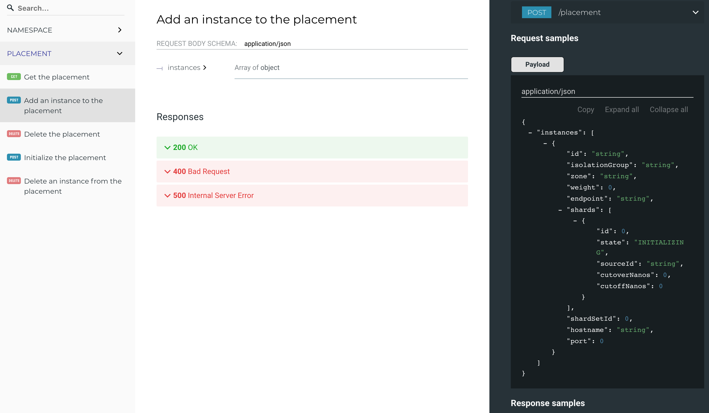

# M3DB Single Node Deployment

Deploying a single-node cluster is a great way to experiment with M3DB and get a feel for what it
has to offer. Our Docker image by default configures a single M3DB instance as one binary
containing:

- An M3DB storage instance (`m3dbnode`) for timeseries storage. This includes an embedded tag-based
  metrics index, as well as as an embedded etcd server for storing the above mentioned cluster
  topology and runtime configuration.
- A "coordinator" instance (`m3coordinator`) for writing and querying tagged metrics, as well as
  managing cluster topology and runtime configuration.

To begin, first start up a Docker container with port `7201` (used to manage the cluster topology)
and port `9003` (used to read and write metrics) exposed. We recommend you create a persistent data
directory on your host for durability:

```
docker run -p 7201:7201 -p 9003:9003 --name m3db -v $(pwd)/m3db_data:/var/lib/m3db quay.io/m3db/m3db:latest
```

<!-- TODO: link to docs containing explanations of what namespaces, the coordinator,
placements, etc. are -->

<!-- TODO: add something about how this is in no way a recommended production deployment guide,
and write a guide for what is considered a production-ready deployment (this is in the works) -->

Next, create an initial namespace for your metrics:

<!-- TODO: link to config reference docs once available -->

```json
curl -X POST localhost:7201/api/v1/namespace/add -d '{
  "name": "default",
  "options": {
    "bootstrapEnabled": true,
    "flushEnabled": true,
    "writesToCommitLog": true,
    "cleanupEnabled": true,
    "snapshotEnabled": false,
    "repairEnabled": false,
    "retentionOptions": {
      "retentionPeriodNanos": 172800000000000,
      "blockSizeNanos": 7200000000000,
      "bufferFutureNanos": 600000000000,
      "bufferPastNanos": 600000000000,
      "blockDataExpiry": true,
      "blockDataExpiryAfterNotAccessPeriodNanos": 300000000000
    },
    "indexOptions": {
      "enabled": true,
      "blockSizeNanos": 7200000000000
    }
  }
}'
```

With a namespace to hold your metrics created, you can initialize your first placement:

```json
curl -X POST localhost:7201/api/v1/placement/init -d '{
    "num_shards": 64,
    "replication_factor": 1,
    "instances": [
        {
            "id": "m3db_local",
            "isolation_group": "rack-a",
            "zone": "embedded",
            "weight": 1024,
            "endpoint": "127.0.0.1:9000",
            "hostname": "127.0.0.1",
            "port": 9000
        }
    ]
}'
```

Shortly after, you should see your node complete bootstrapping! Don't worry if you see warnings or
errors related to a local cache file, such as `[W] could not load cache from file
/var/lib/m3kv/m3db_embedded.json`. Those are expected for a local instance and in general any
warn-level errors (prefixed with `[W]`) should not block bootstrapping.

```
20:10:12.911218[I] updating database namespaces [{adds [default]} {updates []} {removals []}]
20:10:13.462798[I] node tchannelthrift: listening on 0.0.0.0:9000
20:10:13.463107[I] cluster tchannelthrift: listening on 0.0.0.0:9001
20:10:13.747173[I] node httpjson: listening on 0.0.0.0:9002
20:10:13.747506[I] cluster httpjson: listening on 0.0.0.0:9003
20:10:13.747763[I] bootstrapping shards for range starting ...
...
20:10:13.757834[I] bootstrap finished [{namespace default} {duration 10.1261ms}]
20:10:13.758001[I] bootstrapped
20:10:14.764771[I] successfully updated topology to 1 hosts
```

The node also self-hosts its OpenAPI docs, outlining available endpoints. You can access this by
going to `localhost:7201/api/v1/docs` in your browser.



Now you can experiment with writing tagged metrics:
```json
curl -sSf -X POST http://localhost:9003/writetagged -d '{
  "namespace": "default",
  "id": "foo",
  "tags": [
    {
      "name": "city",
      "value": "new_york"
    },
    {
      "name": "endpoint",
      "value": "/request"
    }
  ],
  "datapoint": {
    "timestamp": '"$(date "+%s")"',
    "value": 42.123456789
  }
}
'
```

And reading the metrics you've written:
```json
curl -sSf -X POST http://localhost:9003/query -d '{
  "namespace": "default",
  "query": {
    "regexp": {
      "field": "city",
      "regexp": ".*"
    }
  },
  "rangeStart": 0,
  "rangeEnd": '"$(date "+%s")"'
}' | jq .

{
  "results": [
    {
      "id": "foo",
      "tags": [
        {
          "name": "city",
          "value": "new_york"
        },
        {
          "name": "endpoint",
          "value": "/request"
        }
      ],
      "datapoints": [
        {
          "timestamp": 1527039389,
          "value": 42.123456789
        }
      ]
    }
  ],
  "exhaustive": true
}
```
