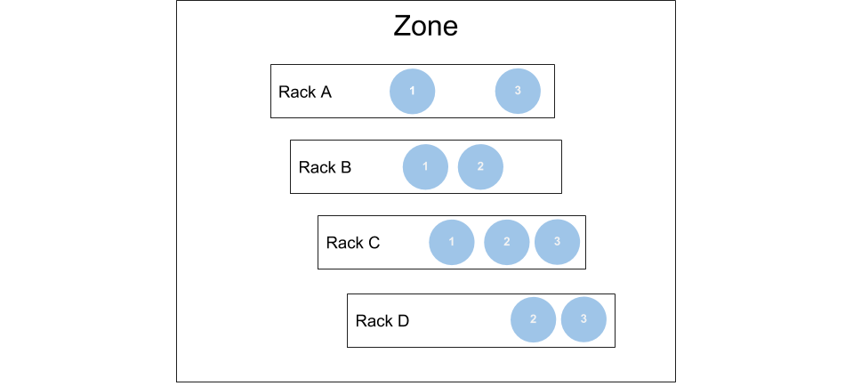
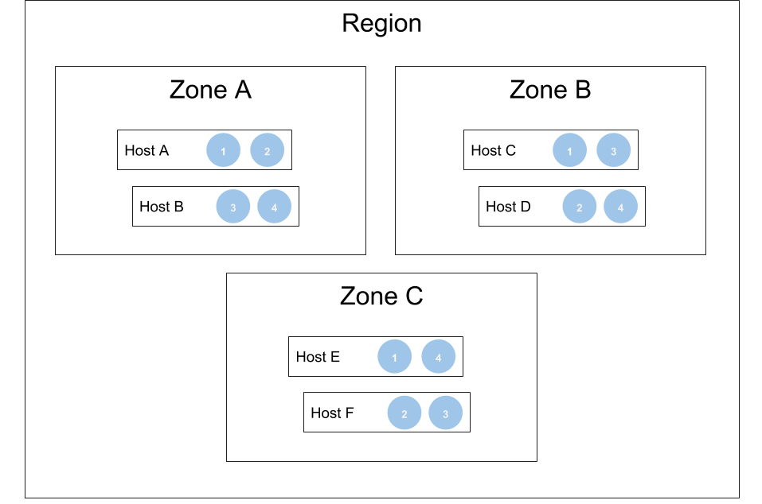

# Replication and Deployment in Zones

## Overview

M3DB supports deployment to both a single zone, with rack level isolation, and deployment across multiple zones in a region. You can also deploy M3DB across multiple regions for a global view of data, however you may experience higher ingestion latency and cross region bandwidth costs. You may want to use a replication factor of five for such a multi-region cluster to survive multiple regions suffering an outage, or be able to still upgrade hosts while a region is down.

### Replication

It is highly recommended that you use a replication factor of at least 3 for any M3DB deployment. This is due to the default write and read consistency levels requiring a majority of hosts to be available to complete an operation successfully. For more information see the documentation concerning tuning [availability, consistency and durability](availability_consistency_durability.md).

### Upgrading hosts in a deployment

It should be noted that when a host is deployed and it is preparing to serve reads by bootstrapping, the shards are available for writes but not available for reads.

There is a small window during an upgrade between when the process is stopped and then started again where the node is unavailable for writes too.

## Deployment in a single zone

For deployment in a single zone, we recommend you set the `isolationGroup` to the name of the rack a host resides or another logical unit that separates groups of hosts in your zone.

In this configuration hosts are distributed shards of data that will not be placed more than once in the same rack or logical unit you define, which allows you to lose an entire unit at a time that may contain multiple hosts and still stay available since it is guaranteed to only affect one replica of data.

Here's what a deployment in a single zone looks like, in this example the cluster has 3 shards that are spread over 4 racks:

Typically deployments have many more than 3 shards, but this is a simple example that depicts how losing a single rack still maintains availability of two of the three replicas of each shard.

## Deployment across multiple availability zones in a region

For deployment in a region, we recommend you set the `isolationGroup` to the name of the availability zone a host resides.

In this configuration hosts are distributed shards of data that will not be placed more than once in the same availability zone.

Here's what a deployment in a region looks like, in this example the cluster has 4 shards that are spread over 3 availability zones:

Typically deployments have many more than 4 shards, but this is a simple example that depicts how losing a single availability zone still maintains availability of two of the three replicas of each shard.

<!-- **Note:** Placement of shards in a replica do not mirror other replicas and shards are placed in a way to best load balance shards across available hosts in a single isolation group. This could mean that hosts in an availability zones that have less hosts will do more work than those in an availability zone with more hosts. -->

## Deployment across multiple regions

For deployment across regions, we recommend you set the `isolationGroup` to the name of the region a host resides.

As mentioned before you may experience higher ingestion latency and cross region bandwidth costs for a cluster that spans regions. You may also want to use a replication factor of five for such a multi-region cluster to survive multiple regions suffering an outage, or be able to still upgrade hosts while a region is down.

In this configuration hosts are distributed shards of data that will not be placed more than once in the same region.

Here's what a deployment across regions looks like, in this example the cluster has 4 shards that are spread over 5 regions:

Typically deployments have many more than 4 shards, but this is a simple example that depicts how losing up to two regions still maintains availability of three of the five replicas of each shard.

**Note:** Placement of shards in a replica do not mirror other replicas and shards are placed in a way to best load balance shards across available hosts in a single isolation group. This could mean that hosts in a region that have less hosts will do more work than those in a region with more hosts.
