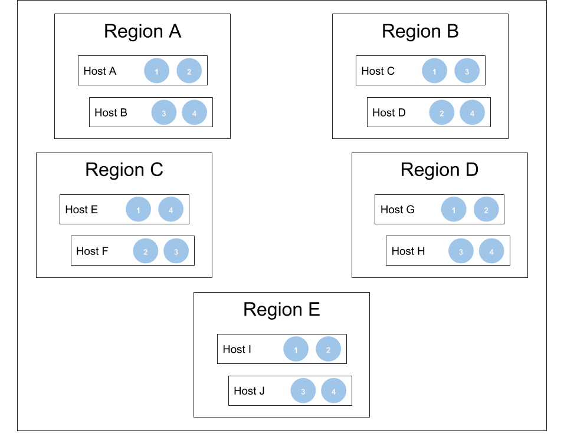

# Replication and Deployment in Zones

## Overview

M3DB supports both deploying across multiple zones in a region or deploying to a single zone with rack-level isolation. It can also be deployed across multiple regions for a global view of data, though both latency and bandwidth costs may increase as a result.

### Replication

A replication factor of at least 3 is highly recommended for any M3DB deployment, due to the consistency levels (for both reads and writes) that require quorum in order to complete an operation. For more information on consistency levels, see the documentation concerning [tuning availability, consistency and durability](availability_consistency_durability.md).

M3DB will do its best to distribute shards evenly among the availability zones while still taking each individual node's weight into account, but if some of the availability zones have less available hosts than others then each host in that zone will be responsible for more shards than hosts in the other zones and will thus be subjected to heavier load.

### Upgrading hosts in a deployment

When an M3DB node is restarted it has to perform a bootstrap process before it can serve reads. During this time the node will continue to accept writes, but will not be available for reads.

Obviously, there is also a small window of time during between when the process is stopped and then started again where it will also be unavailable for writes.

## Deployment across multiple availability zones in a region

For deployment in a region, it is recommended to set the `isolationGroup` host attribute to the name of the availability zone a host is in.

In this configuration, shards are distributed among hosts such that each will not be placed more than once in the same availability zone. This allows an entire availability zone to be lost at any given time, as it is guaranteed to only affect one replica of data.

For example, in a multi-zone deployment with four shards spread over three availability zones:

Typically, deployments have many more than four shards - this is a simple example that illustrates how M3DB maintains availability while losing an availability zone, as two of three replicas are still intact.

## Deployment in a single zone

For deployment in a single zone, it is recommended to set the `isolationGroup` host attribute to the name of the rack a host is in or another logical unit that separates groups of hosts in your zone.

In this configuration, shards are distributed among hosts such that each will not be placed more than once in the same defined rack or logical unit. This allows an entire unit to be lost at any given time, as it is guaranteed to only affect one replica of data.

For example, in a single-zone deployment with three shards spread over four racks:

Typically, deployments have many more than three shards - this is a simple example that illustrates how M3DB maintains availability while losing a single rack, as two of three replicas are still intact.

## Deployment across multiple regions

For deployment across regions, it is recommended to set the `isolationGroup` host attribute to the name of the region a host is in.

As mentioned previously, latency and bandwidth costs may increase when using clusters that span regions.

In this configuration, shards are distributed among hosts such that each will not be placed more than once in the same region. This allows an entire region to be lost at any given time, as it is guaranteed to only affect one replica of data.

For example, in a multi-region deployment with four shards spread over five regions:

Typically, deployments have many more than four shards - this is a simple example that illustrates how M3DB maintains availability while losing up to two regions, as three of five replicas are still intact.
