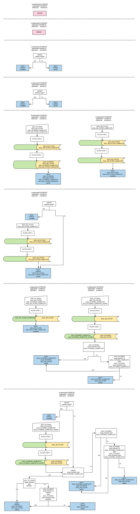

# Fetching and querying

## Fetch fanout

Since M3Query does not currently have a view into the M3DB index, fanout to multiple clusters is rather complicated. Since not every metric is necessarily in every cluster (as an example, carbon metrics routed to a certain resolution), it is not trivial to determine which namespaces should be queried to return a fully correct set of recorded metrics.

The general approach is therefore to attempt to fanout to any namespace which has a complete view of all metrics, for example, Unaggregated, and take that if it fulfills query range; if not, M3 Query will attempt to stitch together namespaces with longer retentions to try and build the most complete possible view of stored metrics.

The full logic is described in this image:

